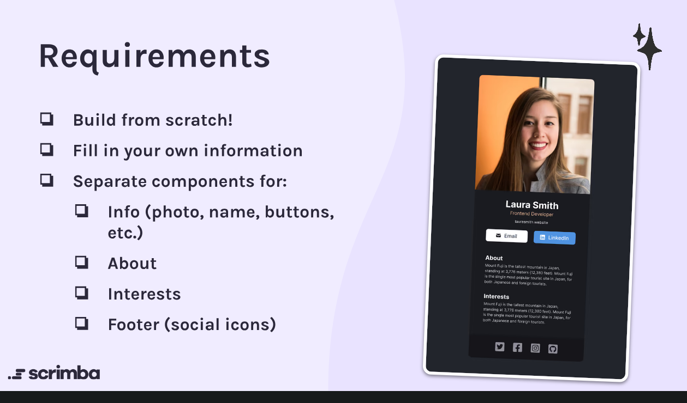

# My digital business card
My digital business card, following this template, created by scratch
https://www.figma.com/design/4ctPLUvIn5b5Ep6YPOZWWd/Digital-Business-Card?node-id=0-1&node-type=canvas&t=fb138NISd5UBN10q-0

# integration with githubpage
in vite.config.js
  base: "/repo-name/", // replace 'repo-name' with your actual repository name

npm run build

npm run preview per fare il check locally

cp -r dist dst/dist/card

